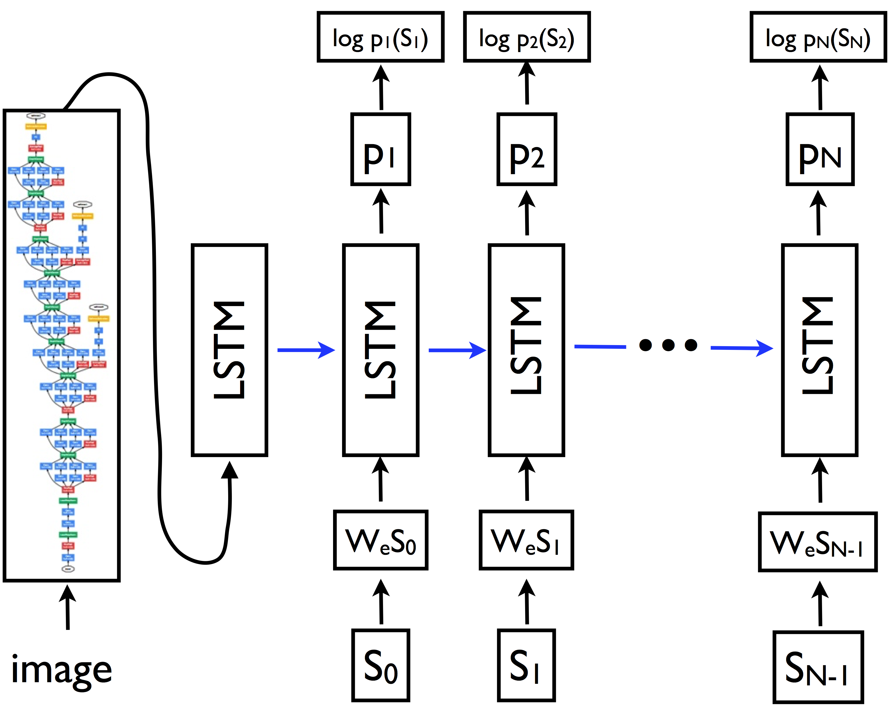

# Show and Tell: A Neural Image Caption Generator
본 저장소는 TensorFlow 라이브러리를 이용하여 Image Captioning에 관한 아래 논문을 구현한 코드입니다.

"Show and Tell: Lessons learned from the 2015 MSCOCO Image Captioning
Challenge."

Oriol Vinyals, Alexander Toshev, Samy Bengio, Dumitru Erhan.

*IEEE transactions on pattern analysis and machine intelligence (2016).*

전체 논문 링크: http://arxiv.org/abs/1609.06647

***Author:*** Chris Shallue

### Image Captioning

Show and Tell 모델은 Image Captioning을 수행합니다. Image Captioning의 예시는 아래와 같습니다.


### Show and Tell Model Architecture
Show and Tell Model Architecture는 아래와 같습니다.


코드를 실행하기 위해서는 아래 과정을 단계별로 수행해야 합니다.

### 트레이닝 데이터 준비하기
MS COCO 트레이닝 데이터를 준비하기 위해 다음의 과정을 수행합니다. 아래 과정은 shell script를 이용하여 MS COCO 데이터셋을 다운받고 TFRecord 포맷으로 변환합니다.
```shell
# 아래 명령어로 ${HOME} 경로를 확인합니다. e.g. /home/solaris
cat ${HOME}

# MS COCO 데이터셋을 다운받을 경로를 설정합니다. e.g. /home/solaris/im2txt/data/mscoco
MSCOCO_DIR="${HOME}/im2txt/data/mscoco"

# im2txt/im2txt 폴더에서 아래 명령어를 실행해서 MSCOCO_DIR 경로에 MS COCO 데이터셋을 다운 받습니다.
sudo chmod 700 data/download_and_preprocess_mscoco.sh
./download_and_preprocess_mscoco.sh ${MSCOCO_DIR}
```

아래 메세지가 출력되면 모든 프로세스가 정상적으로 완료된 것입니다.
```shell
2016-09-01 16:47:47.296630: Finished processing all 20267 image-caption pairs in data set 'test'.
```


### Inception v3 체크포인트(Checkpoint) 다운로드
Pre-Trained된 Inception v3 모델을 준비하기 위해 다음의 과정을 수행합니다.
```shell
# Inception v3 체크포인트 파일을 다운로드 받을 경로를 지정합니다. e.g. /home/solaris/im2txt/data
INCEPTION_DIR="${HOME}/im2txt/data"
mkdir -p ${INCEPTION_DIR}

wget "http://download.tensorflow.org/models/inception_v3_2016_08_28.tar.gz"
tar -xvf "inception_v3_2016_08_28.tar.gz" -C ${INCEPTION_DIR}
rm "inception_v3_2016_08_28.tar.gz"
```

### 모델 트레이닝 (Initial Training)
이제 준비가 모두 끝났습니다. Show and Tell 모델을 학습시키기 위해서 아래 과정을 수행합니다.
```shell
# MS COCO 데이터를 다운받은 경로를 지정합니다.
MSCOCO_DIR="${HOME}/im2txt/data/mscoco"

# Inception v3 체크포인트 파일을 다운로드 받은 경로를 지정합니다.
INCEPTION_CHECKPOINT="${HOME}/im2txt/data/inception_v3.ckpt"

# 모델의 학습결과(가중치)를 저장할 경로를 지정합니다.
MODEL_DIR="${HOME}/im2txt/model"

# im2txt 모듈을 사용하기 위해 환경변수를 설정합니다.
# {im2txt 폴더가 있는 경로}에 im2txt 폴더 경로를 지정합니다. e.g. /home/solaris/deep-learning-tensorflow-book-code/Ch09-Image_Captioning/im2txt
export PYTHONPATH="$PYTHONPATH:{im2txt폴더가 있는 경로}"

# 트레이닝 코드를 실행합니다.
python train.py \
  --input_file_pattern="${MSCOCO_DIR}/train-?????-of-00256" \
  --inception_checkpoint_file="${INCEPTION_CHECKPOINT}" \
  --train_dir="${MODEL_DIR}/train" \
  --train_inception=false \
  --number_of_steps=1000000
```

### 캡션 생성하기
트레이닝 끝나면, 아래 과정을 통해 이미지에 대한 캡션을 생성합니다.
```shell

# 모델의 체크포인트가 저장된 경로를 지정합니다.
CHECKPOINT_PATH="${HOME}/im2txt/model/train"

# 전처리 과정의 결과로 어휘(Vocabulary)가 저장된 경로를 지정합니다.
VOCAB_FILE="${HOME}/im2txt/data/mscoco/word_counts.txt"

# 이미지 캡셔닝을 진행할 이미지의 경로를 설정합니다.
IMAGE_FILE="${HOME}/im2txt/data/mscoco/raw-data/val2014/COCO_val2014_000000224477.jpg"

# GPU를 사용하지 않도록 설정합니다.
# (만약 트레이닝을 진행중이어서 GPU 메모리 용량이 충분치 않을 경우와 같이 필요할 때만 적용하면 됩니다.)
export CUDA_VISIBLE_DEVICES=""

# im2txt 모듈을 사용하기 위해 환경변수를 설정합니다.
# {im2txt 폴더가 있는 경로}에 im2txt 폴더 경로를 지정합니다. e.g. /home/solaris/deep-learning-tensorflow-book-code/Ch09-Image_Captioning/im2txt
export PYTHONPATH="$PYTHONPATH:{im2txt폴더가 있는 경로}"

# 캡션을 생성합니다.
python run_inference.py \
  --checkpoint_path=${CHECKPOINT_PATH} \
  --vocab_file=${VOCAB_FILE} \
  --input_files=${IMAGE_FILE}
```

학습이 잘 진행된 경우 아래와 같이 그럴듯한 캡션을 생성해내는 모습을 볼 수 있습니다.

인풋 이미지:


출력 결과:

```shell
Captions for image COCO_val2014_000000224477.jpg:
  0) a man riding a wave on top of a surfboard . (p=0.040413)
  1) a person riding a surf board on a wave (p=0.017452)
  2) a man riding a wave on a surfboard in the ocean . (p=0.005743)
```

### Inception v3 모델 Fine-Tunining하기
위의 Initial Training 과정은 Inception v3 모델은 Freeze 상태(파라미터를 고정한 상태)로 학습합니다.
성능을 더 향상 시키고 싶을 경우, Initial Training 후에 아래와 같이 Inception v3 모델까지 Fine-Tunining하는 학습을 한번더 수행할 수 있습니다.
```shell
# --train_inception=true로 학습을 한번더 진행합니다.
python train.py \
  --input_file_pattern="${MSCOCO_DIR}/train-?????-of-00256" \
  --train_dir="${MODEL_DIR}/train" \
  --train_inception=true \
  --number_of_steps=3000000  # 2000000 steps을 더 추가합니다. (Initial Training으로 1000000 steps을 진행했다고 가정합니다.).
```